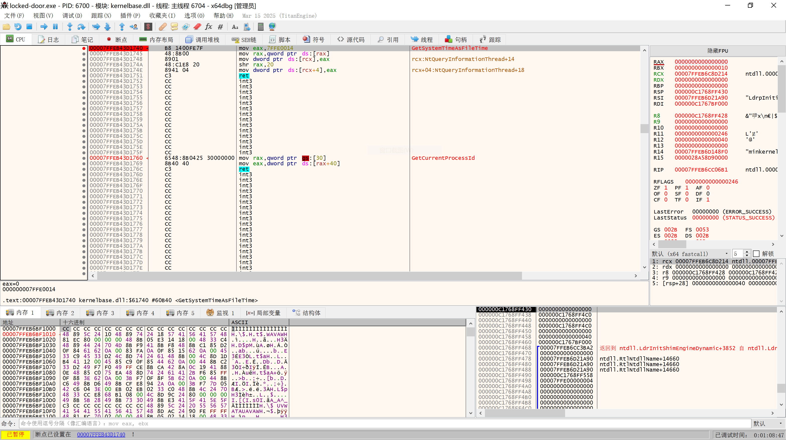
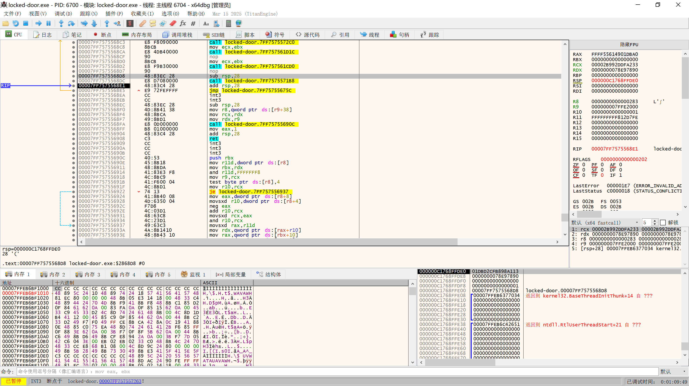
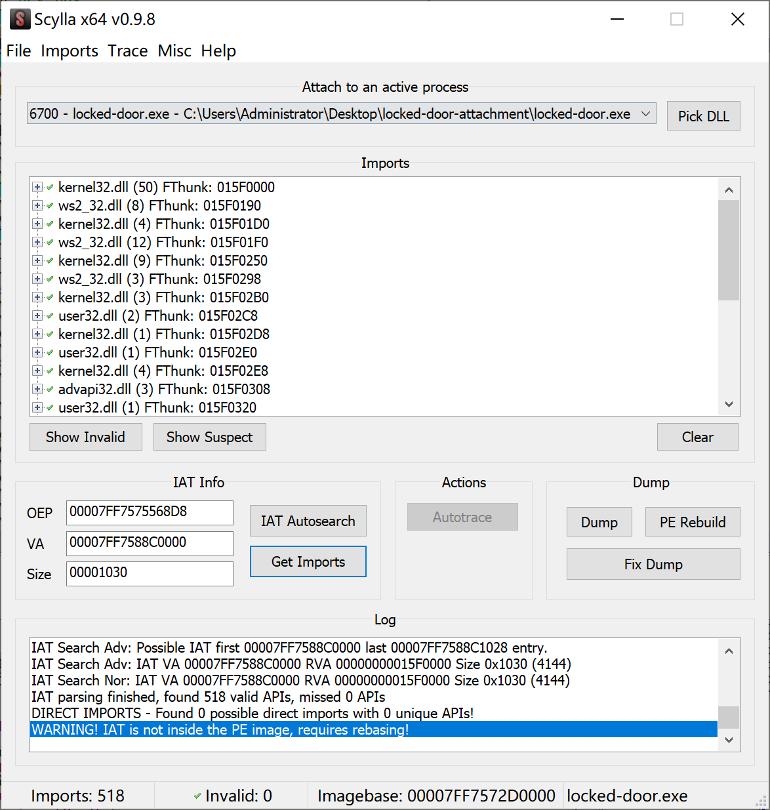

# locked door Writeup

```text
此为原来预期解的Writeup，但是由于各位师傅的神力以及程序本身的漏洞等原因，出现了很多比预期更快更方便的解法
```

可以在这里[locked door](https://github.com/mufeng05/locked-door)看到程序的源码

查看题目附件发现加了vmp壳，且存在反调试，运行调试会被检测弹窗退出，正常运行后提示key1正确但是key2错误


新开一个虚拟机，加载[TitanHide](https://github.com/mrexodia/TitanHide)驱动过反调试

在x64dbg中给`GetSystemTimeAsFileTime`这个函数下断点，成功找到OEP，用自带的Scylla工具dump解压后的程序




> 可选：使用[VMP-Import-Fix](https://github.com/PlaneJun/VMP-Import-Fix)修复IAT后再导出，但也可以不修复IAT，因为程序本身就有已经被虚拟化的函数，修复了也运行不了
> 

同时在x64dbg中动调时发现出现了类似RSA公钥的字符串


用IDA打开dump出来的程序，理解程序的大致运行流程是，读取一个key，解密key（魔改AES），再用公钥验证key，使用RSA2048_SHA256验证算法，这个key实际上就是签名


本来是想通过hook `EVP_DigestVerifyFinal`这个函数，使其永远返回验证通过来绕过验证，但是发现程序对这个函数进行了函数头验证，无法被hook


因为key2是错误的，而且我们不知道私钥是什么，没法给程序生成正确的key2，那就只能重新生成一组公私钥，把key2的明文重新签名后替换，再替换程序中的公钥来让程序绕过验证，继续运行

在IDA中发现验证key1和key2之间存在一个`memcpy`来拷贝公钥，可以通过hook这个`memcpy`来实现替换程序中的公钥


首先需要逆向魔改AES的解密逻辑，先提取出S盒和密钥，然后写出正确的加密逻辑


```c
#define BLOCK_SIZE 256
#define ROUNDS 14

uint8_t sbox[256] = {
    0x20, 0x39, 0x1D, 0xA2, 0x22, 0x70, 0xB0, 0xA1, 0x90, 0xEE, 0xF4, 0xC3, 0x2B, 0x48, 0x56, 0x4E,
    0xA6, 0xD2, 0xD1, 0x9A, 0x2C, 0x3E, 0xA0, 0x83, 0xB2, 0xF7, 0xB5, 0x99, 0x26, 0x03, 0xBD, 0xEA,
    0x4C, 0xC2, 0x89, 0x8C, 0x61, 0x24, 0xA4, 0xCC, 0x31, 0x7F, 0x5F, 0x7B, 0x02, 0xF9, 0x28, 0x86,
    0x8A, 0xFD, 0x79, 0x8B, 0x4F, 0x30, 0x12, 0x9E, 0xF1, 0x5A, 0x63, 0x3D, 0x43, 0xDB, 0x21, 0xC1,
    0x2F, 0xF2, 0x1C, 0x52, 0xCE, 0xDF, 0x18, 0x82, 0x9B, 0x0C, 0xDD, 0x16, 0xDC, 0x51, 0xF6, 0x41,
    0x78, 0x91, 0xAB, 0xBB, 0x6F, 0x36, 0x2D, 0xD0, 0x65, 0x00, 0x42, 0x96, 0x08, 0xA5, 0x5D, 0xAA,
    0xAE, 0xC4, 0x1F, 0x77, 0x14, 0x72, 0xB7, 0xFC, 0x60, 0x6C, 0xC6, 0xAD, 0xCD, 0x3B, 0xBF, 0x9F,
    0xA8, 0x9D, 0x9C, 0xB4, 0x38, 0x7C, 0xFE, 0xD6, 0xB8, 0x1E, 0x0B, 0x3F, 0xAF, 0x68, 0x80, 0xCB,
    0xD5, 0x1A, 0x47, 0x6E, 0x5C, 0x17, 0xB1, 0xB3, 0x76, 0x93, 0x01, 0x97, 0xA3, 0xF3, 0x33, 0xD9,
    0x10, 0x8E, 0x84, 0x0E, 0xC0, 0x53, 0x87, 0xB9, 0xED, 0x50, 0x95, 0xFF, 0xEC, 0x3A, 0x6A, 0x57,
    0xD3, 0xF8, 0x06, 0xB6, 0xEF, 0x4D, 0x8F, 0x45, 0xE5, 0x74, 0x29, 0x54, 0x1B, 0xDA, 0x3C, 0x07,
    0x4B, 0x23, 0x49, 0x34, 0x7A, 0x88, 0x67, 0xFB, 0x71, 0x94, 0x27, 0xE8, 0x64, 0xCA, 0x0D, 0xC9,
    0xE3, 0xD8, 0x58, 0x05, 0x66, 0xE4, 0x59, 0xE0, 0xE1, 0x46, 0xA7, 0x0F, 0x6D, 0xD4, 0x92, 0x40,
    0xC7, 0xE9, 0x8D, 0xCF, 0x6B, 0x35, 0x7E, 0xFA, 0x04, 0x11, 0x62, 0x85, 0x0A, 0x75, 0x55, 0xC8,
    0x37, 0x2A, 0xC5, 0x5E, 0x81, 0x4A, 0xE2, 0x15, 0x13, 0xAC, 0xEB, 0x2E, 0xBC, 0xDE, 0xD7, 0xF5,
    0xE6, 0xBA, 0x7D, 0x25, 0x98, 0x69, 0x73, 0x5B, 0xBE, 0xE7, 0x32, 0xA9, 0x09, 0x19, 0xF0, 0x44,
};

uint8_t master_key[BLOCK_SIZE] = {
    0x2B, 0xEC, 0xC3, 0x54, 0xA5, 0x21, 0x18, 0x98, 0xB9, 0xCB, 0xE6, 0x68, 0xED, 0xC1, 0x84, 0x05,
    0x86, 0xE5, 0x91, 0x37, 0x74, 0xB3, 0x59, 0xC7, 0x63, 0x03, 0x53, 0x69, 0x8E, 0xFF, 0xC9, 0x41,
    0x4F, 0x45, 0xA9, 0x3D, 0xCE, 0x48, 0xA3, 0x35, 0x20, 0xE3, 0x16, 0xFE, 0xDB, 0x0C, 0xA6, 0x90,
    0x7E, 0x00, 0x7D, 0x99, 0x76, 0x60, 0x7F, 0x66, 0x8F, 0x0E, 0x2F, 0x46, 0x19, 0xB8, 0xAF, 0x55,
    0x95, 0x3C, 0xB5, 0x5D, 0x28, 0x93, 0x0F, 0x8B, 0x01, 0x1B, 0x44, 0x47, 0x40, 0x17, 0x70, 0xB4,
    0x9C, 0x6D, 0x79, 0x1F, 0x82, 0xEE, 0x5B, 0xA4, 0x4D, 0x72, 0x92, 0x97, 0x87, 0xDC, 0xF0, 0x5E,
    0xDA, 0xD4, 0xD5, 0xF5, 0x06, 0xCA, 0x89, 0x6B, 0xD8, 0xC5, 0xE7, 0xE8, 0x32, 0x77, 0x0B, 0xFC,
    0x50, 0xE0, 0x71, 0xC0, 0x73, 0xC6, 0xA0, 0xF4, 0x58, 0x7C, 0x23, 0xF2, 0x24, 0xF7, 0xD1, 0x78,
    0xEF, 0xBD, 0x5C, 0xBF, 0xBE, 0x3B, 0x33, 0x5A, 0x67, 0xD2, 0x52, 0x39, 0x31, 0xF6, 0xF9, 0x81,
    0x22, 0xDF, 0x57, 0x4A, 0x3F, 0xA1, 0xD3, 0x6A, 0xAD, 0x9A, 0x1C, 0x1D, 0x43, 0x85, 0x12, 0x2E,
    0x88, 0x34, 0x2A, 0xC4, 0x0D, 0x2C, 0x13, 0x1E, 0xBC, 0x36, 0x9D, 0x0A, 0xEB, 0xDE, 0xF8, 0x15,
    0xD9, 0xC8, 0x61, 0xD7, 0x30, 0x9F, 0x8C, 0x08, 0xAC, 0xB7, 0xCC, 0x4B, 0x1A, 0x6E, 0x29, 0x80,
    0xB0, 0x5F, 0x6C, 0x27, 0x7B, 0x14, 0x49, 0xE9, 0xDD, 0xAA, 0x09, 0xAB, 0xD6, 0xA7, 0x2D, 0xB1,
    0x8D, 0x42, 0x4C, 0x04, 0xCD, 0x6F, 0x02, 0xE2, 0xF3, 0xAE, 0x7A, 0x9B, 0xB2, 0xA2, 0xBA, 0x38,
    0x83, 0xD0, 0xBB, 0x51, 0x25, 0xF1, 0x11, 0x8A, 0xFB, 0x07, 0xFA, 0x3A, 0x96, 0x4E, 0x3E, 0x94,
    0x56, 0xE4, 0x10, 0xE1, 0x62, 0xEA, 0xCF, 0xFD, 0x9E, 0xC2, 0x65, 0x64, 0x26, 0x75, 0xB6, 0xA8,
};

void GenerateRoundKey(uint8_t* round_key, int round) {
    for (int i = 0; i < BLOCK_SIZE; i++) {
        round_key[i] = master_key[i] ^ (round * 0x11);
    }
}

void SubBytes(uint8_t* state) {
    for (int i = 0; i < BLOCK_SIZE; i++) {
        state[i] = sbox[state[i]];
    }
}

void ShiftRows(uint8_t* state) {
    uint8_t temp[BLOCK_SIZE];

    // 每一行分别左移
    for (int i = 0; i < 64; i++) {
        temp[i] = state[i];
    }

    // 第二行左移一个位置
    for (int i = 0; i < 64; i++) {
        temp[64 + i] = state[64 + (i + 1) % 64];
    }

    // 第三行左移两个位置
    for (int i = 0; i < 64; i++) {
        temp[128 + i] = state[128 + (i + 2) % 64];
    }

    // 第四行左移三个位置
    for (int i = 0; i < 64; i++) {
        temp[192 + i] = state[192 + (i + 3) % 64];
    }

    memcpy(state, temp, BLOCK_SIZE);
}

// 魔改 MixColumns：XOR 每列 + 循环左移
void MixColumns(uint8_t* state) {
    for (int col = 0; col < 64; ++col) {
        int base = col * 4;
        uint8_t a = state[base];
        uint8_t b = state[base + 1];
        uint8_t c = state[base + 2];
        uint8_t d = state[base + 3];

        state[base] = a ^ b;
        state[base + 1] = b ^ c;
        state[base + 2] = c ^ d;
        state[base + 3] = (d << 1) | (d >> 7); // 左移1位，带循环
    }
}

void AddRoundKey(uint8_t* state, uint8_t* round_key) {
    for (int i = 0; i < BLOCK_SIZE; i++) {
        state[i] ^= round_key[i];
    }
}

// 主加密函数
void EncryptBlock(uint8_t* input, uint8_t* output) {
    uint8_t state[BLOCK_SIZE];
    memcpy(state, input, BLOCK_SIZE);

    for (int round = 0; round < ROUNDS; round++) {
        uint8_t round_key[BLOCK_SIZE];
        GenerateRoundKey(round_key, round);
        SubBytes(state);
        ShiftRows(state);
        MixColumns(state);
        AddRoundKey(state, round_key);
    }

    memcpy(output, state, BLOCK_SIZE);
}
```

再使用OpenSSL库生成新的key2.bin

```c
#define BLOCK_SIZE 256
#define ROUNDS 14

// RAII 包装器用于 OpenSSL 对象
struct EVP_PKEY_Deleter { void operator()(EVP_PKEY* p) { EVP_PKEY_free(p); } };
using EVP_PKEY_ptr = std::unique_ptr<EVP_PKEY, EVP_PKEY_Deleter>;

struct EVP_MD_CTX_Deleter { void operator()(EVP_MD_CTX* p) { EVP_MD_CTX_free(p); } };
using EVP_MD_CTX_ptr = std::unique_ptr<EVP_MD_CTX, EVP_MD_CTX_Deleter>;

struct OSSL_PARAM_Deleter { void operator()(OSSL_PARAM* p) { OPENSSL_free(p); } };
using OSSL_PARAM_ptr = std::unique_ptr<OSSL_PARAM, OSSL_PARAM_Deleter>;

// 错误处理
void handleErrors() {
    ERR_print_errors_fp(stderr);
    abort();
}

// 生成 RSA 密钥对
EVP_PKEY_ptr generateRSAKeyPair(size_t bits = 2048) {
    EVP_PKEY_ptr pkey(EVP_PKEY_new());
    if (!pkey) handleErrors();

    EVP_PKEY_CTX* ctx = EVP_PKEY_CTX_new_id(EVP_PKEY_RSA, nullptr);
    if (!ctx) handleErrors();

    if (EVP_PKEY_keygen_init(ctx) <= 0) handleErrors();

    // 设置密钥长度
    OSSL_PARAM params[] = {
        OSSL_PARAM_construct_size_t(OSSL_PKEY_PARAM_RSA_BITS, &bits),
        OSSL_PARAM_END
    };
    if (EVP_PKEY_CTX_set_params(ctx, params) <= 0) handleErrors();

    EVP_PKEY* rawPkey = nullptr;
    if (EVP_PKEY_generate(ctx, &rawPkey) <= 0) handleErrors();
    pkey.reset(rawPkey);

    EVP_PKEY_CTX_free(ctx);
    return pkey;
}

// 签名消息
std::vector<unsigned char> signMessage(const std::string& message, EVP_PKEY* pkey) {
    EVP_MD_CTX_ptr ctx(EVP_MD_CTX_new());
    if (!ctx) handleErrors();

    if (EVP_DigestSignInit(ctx.get(), nullptr, EVP_sha256(), nullptr, pkey) <= 0) {
        handleErrors();
    }

    if (EVP_DigestSignUpdate(ctx.get(), message.data(), message.size()) <= 0) {
        handleErrors();
    }

    size_t siglen;
    if (EVP_DigestSignFinal(ctx.get(), nullptr, &siglen) <= 0) {
        handleErrors();
    }

    std::vector<unsigned char> signature(siglen);
    if (EVP_DigestSignFinal(ctx.get(), signature.data(), &siglen) <= 0) {
        handleErrors();
    }

    signature.resize(siglen);
    return signature;
}

// 保存密钥到文件
void saveKeyToFile(EVP_PKEY* pkey, const std::string& filename, bool isPrivate) {
    FILE* fp = fopen(filename.c_str(), "wb");
    if (!fp) {
        std::cerr << "无法打开文件 " << filename << " 进行写入" << std::endl;
        return;
    }

    if (isPrivate) {
        if (!PEM_write_PrivateKey(fp, pkey, nullptr, nullptr, 0, nullptr, nullptr)) {
            fclose(fp);
            handleErrors();
        }
    }
    else {
        if (!PEM_write_PUBKEY(fp, pkey)) {
            fclose(fp);
            handleErrors();
        }
    }

    fclose(fp);
}

void saveAESToFile(uint8_t *text, const std::string& filename,size_t size) {
    FILE* fp = fopen(filename.c_str(), "wb");
    if (!fp) {
        std::cerr << "无法打开文件 " << filename << " 进行写入" << std::endl;
        return;
    }
    fwrite(text, sizeof(uint8_t), size, fp);

    fclose(fp);
}

int main() {
    // 初始化 OpenSSL 3.0
    OPENSSL_init_crypto(OPENSSL_INIT_LOAD_CRYPTO_STRINGS | OPENSSL_INIT_ADD_ALL_CIPHERS
        | OPENSSL_INIT_ADD_ALL_DIGESTS, nullptr);

    // 生成密钥对
    EVP_PKEY_ptr keyPair = generateRSAKeyPair();
    std::cout << "已生成 RSA-2048 密钥对\n";

    // 保存密钥
    saveKeyToFile(keyPair.get(), "private_key.pem", true);
    saveKeyToFile(keyPair.get(), "public_key.pem", false);

    // 要签名的消息
    const char* message = "Here is the key";
    std::vector<unsigned char> signature = signMessage(message, keyPair.get());

    uint8_t ciphertext[BLOCK_SIZE];
    EncryptBlock(signature.data(), ciphertext);
    saveAESToFile(ciphertext, "key2.bin", BLOCK_SIZE);

    // 清理
    EVP_cleanup();
    return 0;
}
```

编写hook memcpy代码，实现替换程序中的公钥

```c
#include "pch.h"
#include <Windows.h>
#include <MinHook.h>
#include <stdio.h>
#include <string.h>
#include <stdint.h>
#include <stdlib.h>
#include <stdbool.h>
#include <stddef.h>
#include <wininet.h>
#include <shlobj.h>
#include <wchar.h>
#include <intrin.h>

typedef int8_t   int8;
typedef int16_t  int16;
typedef int32_t  int32;
typedef int64_t  int64;
typedef uint8_t  uint8;
typedef uint16_t uint16;
typedef uint32_t uint32;
typedef uint64_t uint64;

typedef LPVOID(*api_MemCpy)(LPVOID, LPCVOID, SIZE_T);
static api_MemCpy orig_MemCpy;
static api_MemCpy func_MemCpy;

const size_t PUBKEYLEN = 450;

// 新公钥
const char* NEWPUBKEY = R"(-----BEGIN PUBLIC KEY-----
MIIBIjANBgkqhkiG9w0BAQEFAAOCAQ8AMIIBCgKCAQEAwtVwM8eBuDAjwCCOhrRg
iSMGs1sxd41ZFsB7doOtIV5mqaUp8CAJuP543cJ2VfVO6C8yel1+5xP8jLCVZcMA
94wMnymUmkmj+2VcrOFifhGSKZqmwMvxI4z8j7/kD2+A7Hfx/g3f7triH44pfk/R
Qgfz0/Syrr/ak10ibKJpNZaN+x9I0kWloWdbDXoYlQusE8L/Ouaep/q3dMRPLf3F
xHSQdgBBq4VBMNX+GWX+SwG5gFzCQfv5cxfP1Onsq4vr2mQbnLC5CmlQOSB8Gj4U
ameBnJvpRC15nWhm0jhSnYuinmM64s9poX027nto159nzgBfBFMs7YAB/G+2Ad3b
JQIDAQAB
-----END PUBLIC KEY-----)";

// 我们的钩子函数
static LPVOID hook_MemCpy(LPVOID dst, LPCVOID src, SIZE_T len) {

    uint8* dst_ = static_cast<uint8*>(dst);
    const uint8* src_ = static_cast<const uint8*>(src);
    const uint32* u = static_cast<const uint32*>(src);

    // 匹配原公钥
    if (len == PUBKEYLEN && (u[0] == 0x2d2d2d2d && u[1] == 0x4745422d && u[2] == 0x50204e49 && u[3] == 0x494c4255)) {
        src = NEWPUBKEY;
    }

    return memcpy(dst, src, len);
}

static bool initMemCpyHook() {
    // 获取 memcpy 地址
    HANDLE proc = GetCurrentProcess();
    HMODULE base = GetModuleHandleW(NULL); 
    LPVOID f = reinterpret_cast<LPBYTE>(base) + 0x002A7910;
    func_MemCpy = reinterpret_cast<api_MemCpy>(f);

    // 创建钩子
    if (MH_CreateHook(f, &hook_MemCpy, (LPVOID*)&orig_MemCpy) != MH_OK) {
        printf("Hook memcpy creation failed\n");
        return FALSE;
    }

    // 启用钩子
    if (MH_EnableHook(f) != MH_OK) {
        printf("Hook memcpy enable failed\n");
        return FALSE;
    }

    printf("Memcpy hook installed successfully\n");
    return TRUE;
}

// 安装钩子
static BOOL InstallHook() {
    if (MH_Initialize() != MH_OK) {
        printf("MinHook initialization failed\n");
        return FALSE;
    }

    if (!initMemCpyHook()) {
        printf("Failed to initialize memcpy hook\n");
    }

    if (MH_EnableHook(MH_ALL_HOOKS) != MH_OK) {
        printf("Hook enable failed\n");
        return FALSE;
    }

    printf("Hook installed successfully\n");
    return TRUE;
}

// 移除钩子
static BOOL RemoveHook() {
    if (MH_DisableHook(MH_ALL_HOOKS) != MH_OK) {
        printf("Hook disable failed\n");
        return FALSE;
    }

    if (MH_Uninitialize() != MH_OK) {
        printf("MinHook uninitialization failed\n");
        return FALSE;
    }

    printf("Memcpy hook removed successfully\n");
    return TRUE;
}

static BOOL APIENTRY DllMain(HMODULE hModule,
    DWORD  ul_reason_for_call,
    LPVOID lpReserved)
{
    switch (ul_reason_for_call)
    {
    case DLL_PROCESS_ATTACH:
        InstallHook();
        break;
    case DLL_THREAD_ATTACH:
    case DLL_THREAD_DETACH:
    case DLL_PROCESS_DETACH:
        RemoveHook();
        break;
    }
    return TRUE;
}
```

将新生成的key2.bin替换原来的key2.bin，再使用x64dbg加载编译出来的`hook-memcpy.dll`（需要等程序完全释放出来，即到达OEP之后加载dll），最终获取到flag


